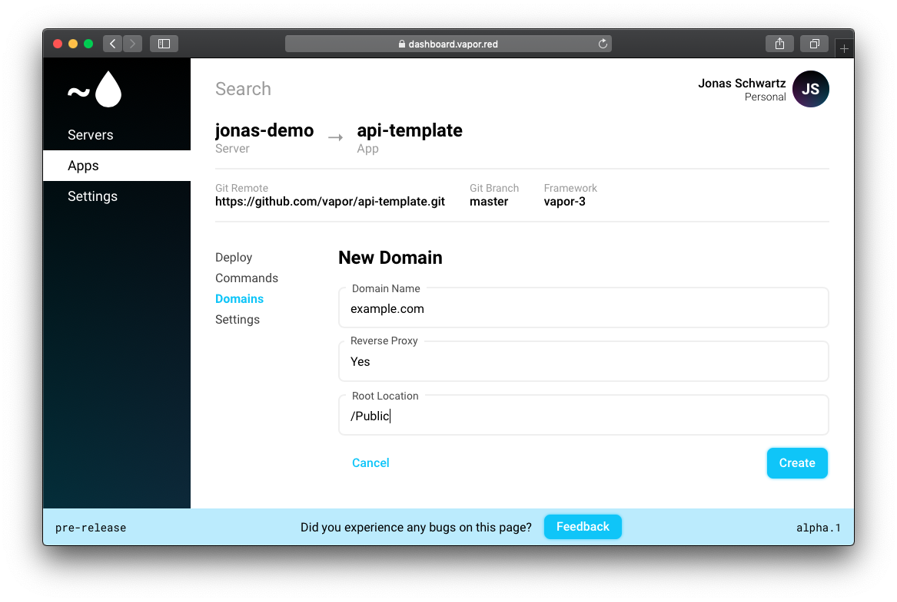
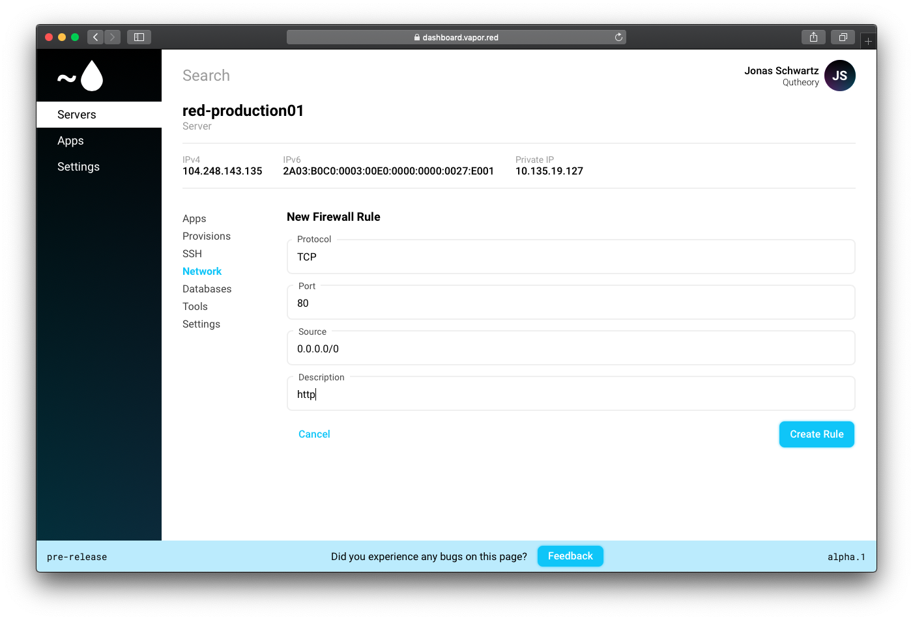
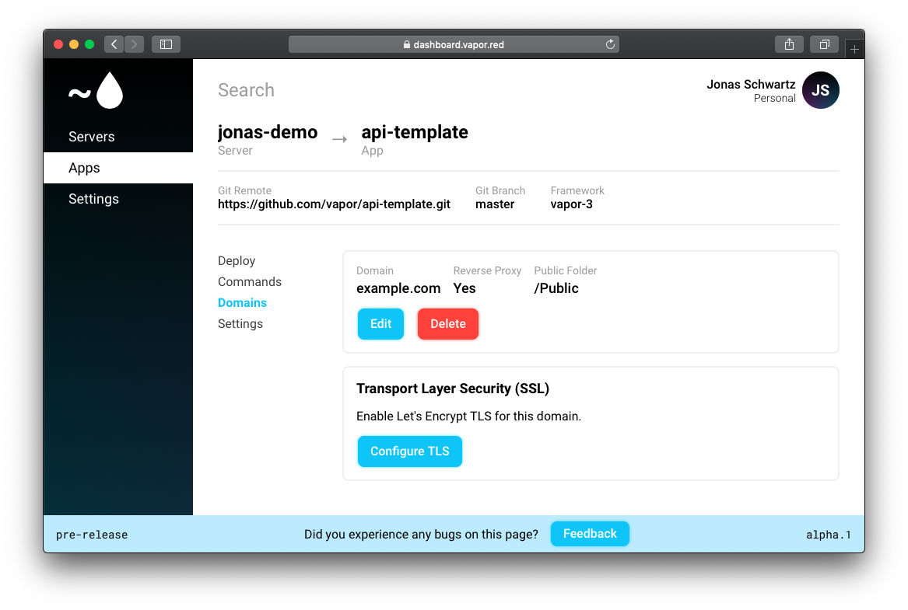

# Setup domain

If you want to use your own domain name for Vapor Red, you can easily set this up. First make sure you install nginx under `Tools`.

!!! important
    Before your domain work, make sure to setup an A record in your DNS to your servers ip.

Go to your desired application, and press the add button.

Enter your domain name, and then setup Reverse Proxy and Root location

* Reverse proxy states if it should proxy the connection to the application, this should be **yes** for Vapor apps
* Root location this is where in the app folder where to load static files, for Vapor apps this should be **/Public**

After the state of the domain is `Running`, you can click on it, here can edit, delete and setup TLS.

Before you can access the nginx instance publicly we need to open up the firewall for port 80 and 443, this can be done like this

!!! important
    Before setting up TLS, make sure you have setup DNS for the domain

Under `Edit` you can edit the domain, including the Nginx config file.

