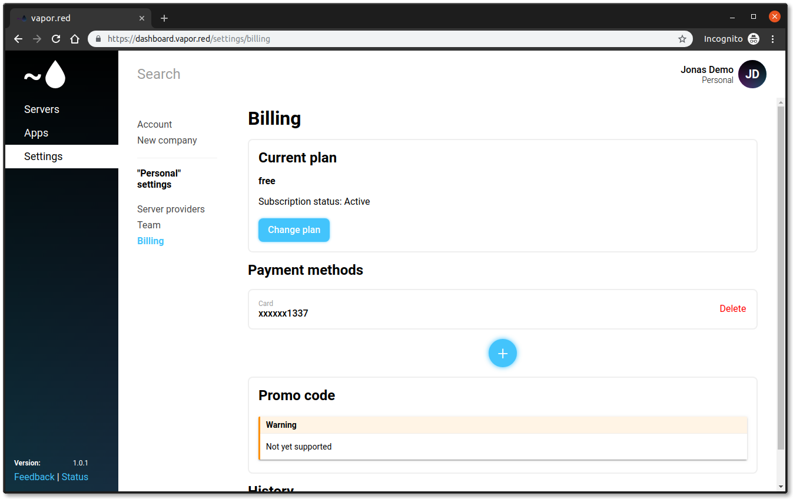
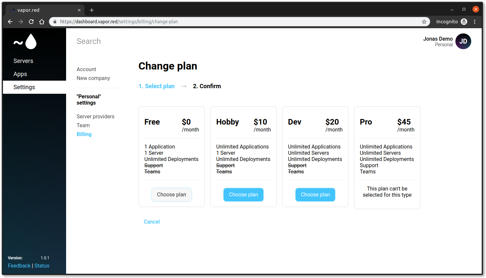

# Billing

Vapor Red provides a fully featured free plan, allowing you to setup and manage 1 server and 1 application through Vapor Red. The free plan is free forever.

However sometimes you need more capacity, to do this you can upgrade to one of our paid plans. You can see an overview of our plans below.

| Name | Application(s) | Server(s) | Deployments | Support | Teams | Price |
| ---- | ---- | ---- | ---- | ---- | ---- | ---- |
| Free | 1 | 1 | &#8734; | No | No | $0/month |
| Hobby | &#8734; | 1 | &#8734; | No | No | $10/month |
| Dev | &#8734; | &#8734; | &#8734; | No | No | $20/month |
| Pro | &#8734; | &#8734; | &#8734; | Yes | Yes | $45/month |

All plans comes with unlimited deployments.

## Support

On the Pro plan, support is available. With this, our team of experts are available to help you fix potential problems on your server. We won't fix the problems, but will try to help you where to look for solutions. We will also be available to help if you want input on the setup you want for the app you want to run.

On the other plans, community support are available on Discord.

## Teams

With teams on the Pro plan, you can invite your team members to your company and collaborate on the same servers and apps.

## Change billing plan

!!! important
    Pro plan can only be selected when you are on a company. If you are on a company, you can only select the Pro plan.

To change your billing plan, start by navigating to **Settings** and **Billing**. And add your card by clicking the add icon under the **Payment methods**

After this, you can see your card with the last for digits under the **Payment methods**

Then you can click **Change plan** and select the plan you want to change to.

After you have confirmed the new plan, you will automatically be charged on a monthly basis. You can always revert back to a previous plan if you don't need it anymore.
All payments are handled securely through Stripe, and you can see your billing history under the Billing page.