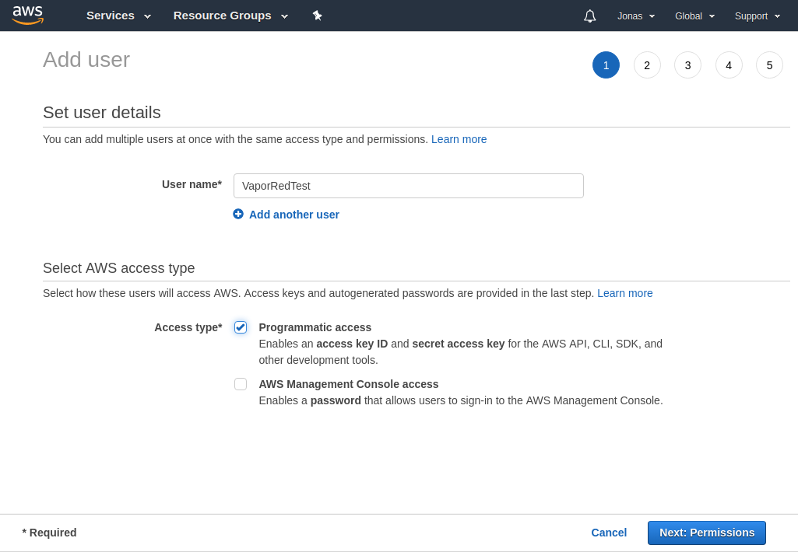
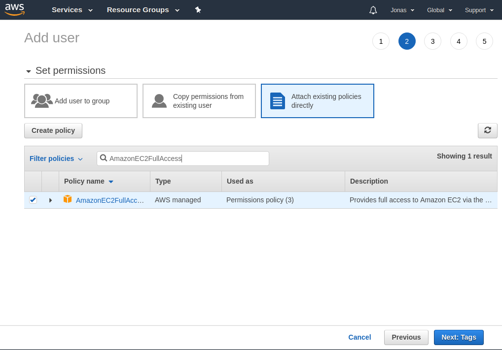
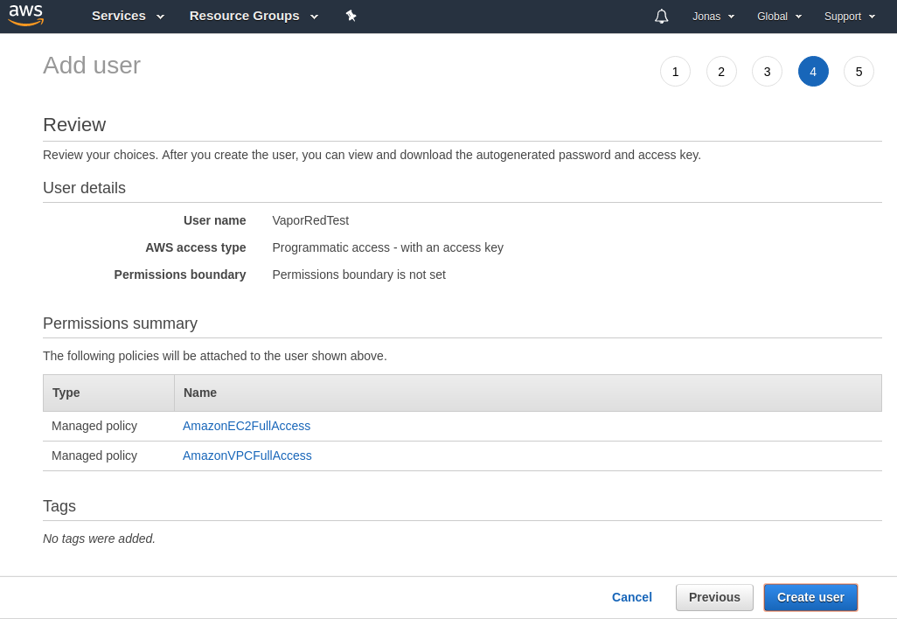
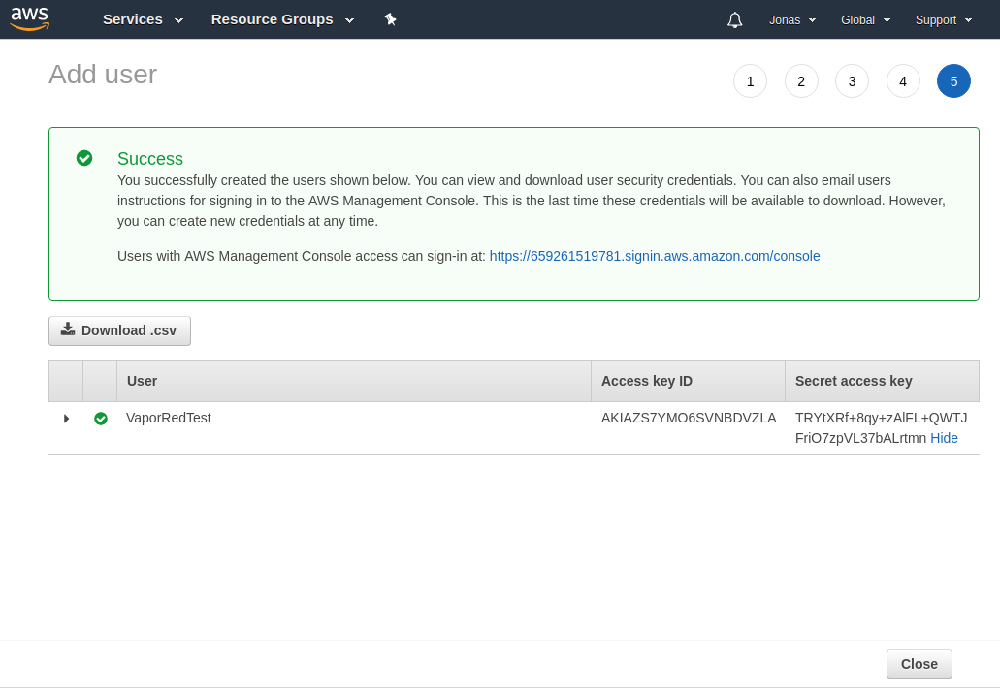
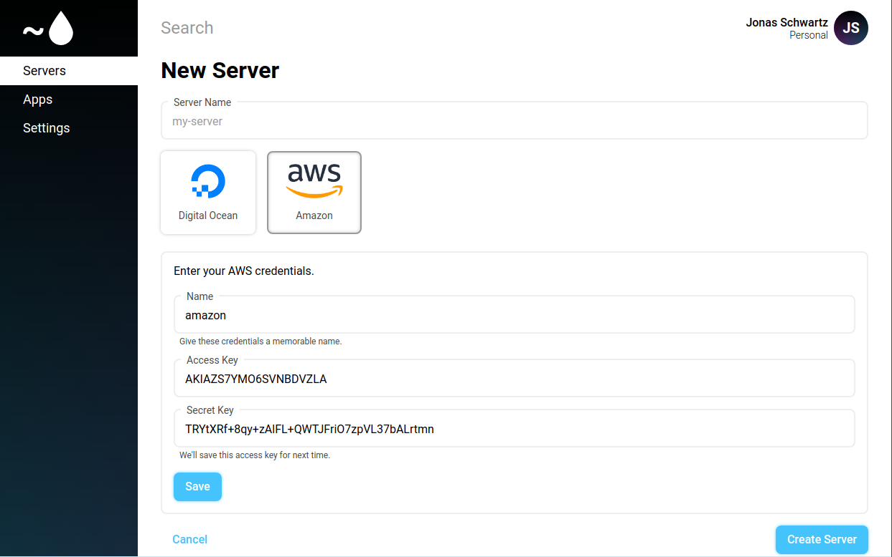
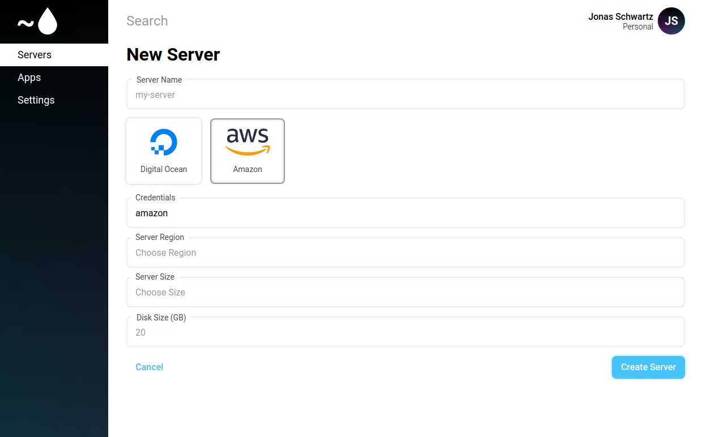

# AWS

This guide will show you how to configure AWS as a Vapor Red provider.

If you have not added AWS credentials to your account, you will be prompted to add them while creating your first server. 

To create your credentials, go to the AWS management console, and go to the `IAM` (Identity and Access Management) service. Click `Users` and create a new User.

Set a name and set it to `Programmatic access`

On the next page, we need to set 2 permissions:

* AmazonEC2FullAccess
* AmazonVPCFullAccess

And then verify the 2 permissions are set correct

Now you get an `Access token` and a `Secret token` we need both, so copy both keys

Now in Vapor Red under AWS setup the `Access token` and `Secret token` in the fields, and find a proper name for it

And we are now ready to create a new AWS server

