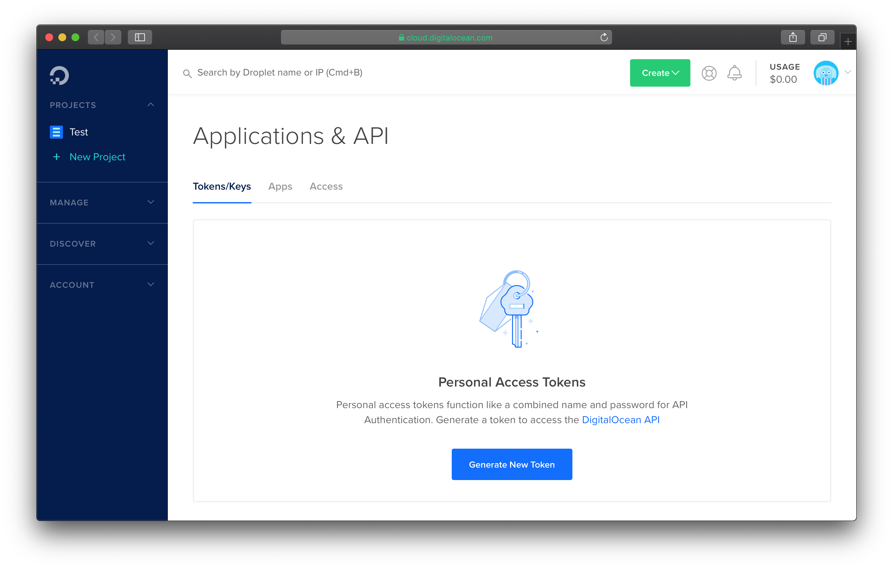
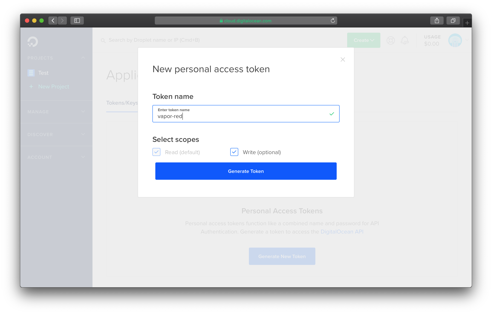
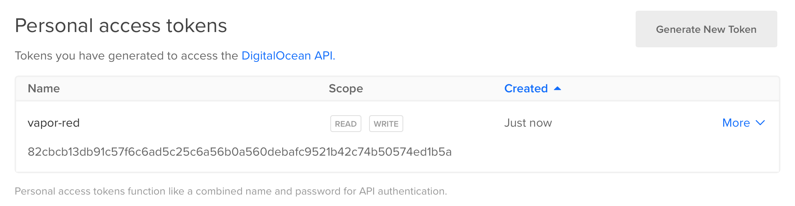
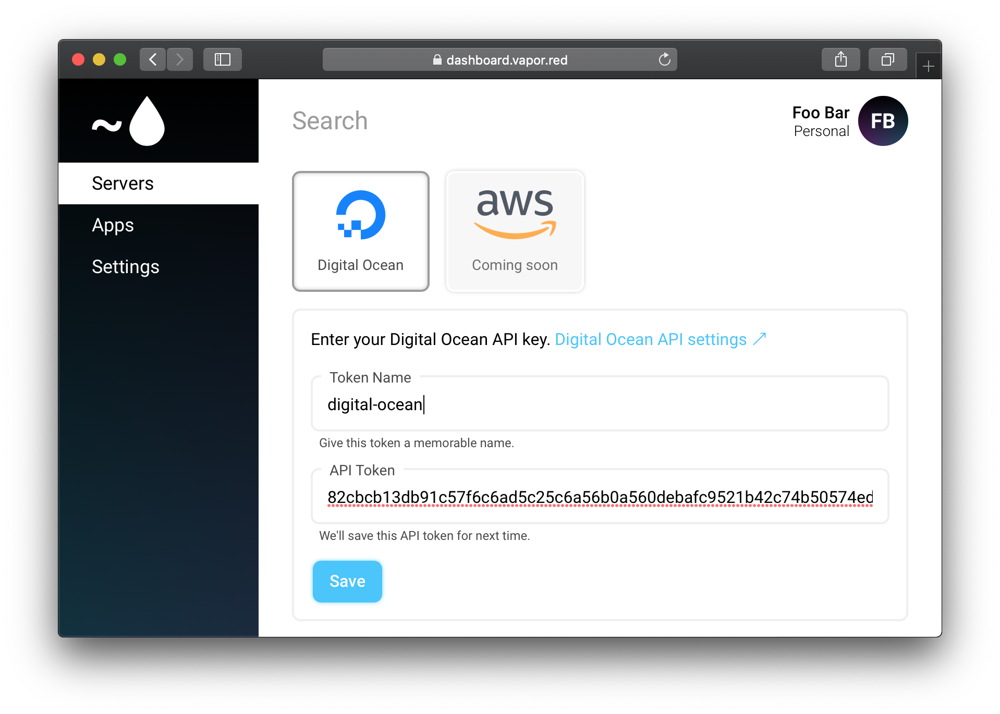
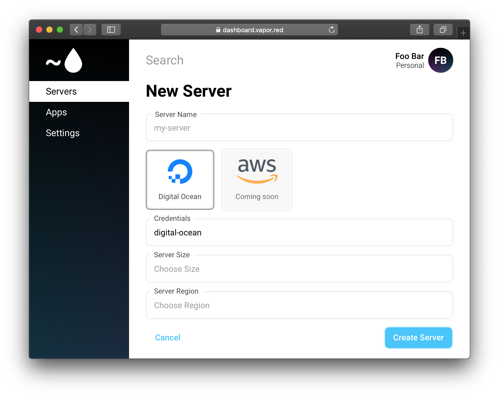

# Digital Ocean

This guide will show you how to configure Digital Ocean as a Vapor Red server provider. 

If you have not added any Digital Ocean credentials to your account, you will be prompted to add them while creating your first server. On this prompt, there will be a link to the [Digital Ocean access token control panel](https://cloud.digitalocean.com/account/api/tokens).

Once you have accessed the token control panel, click Generate New Token.

You can name this token whatever you like, here we are naming it `vapor-red`. Just make sure to select both **Read** and **Write** access.

After the token has been created, copy it. You will only be able to access the token's value once.

Now that you have a Digital Ocean API token, you can enter it into Vapor Red.

Once you click save, the token will be validated. If successful, you will now be able to select your newly added credentials from the Credentials drop down. 

You can now continue creating your server. Continue at [Quick Start &rarr; Create Server](../quick-start.md#create-server)
