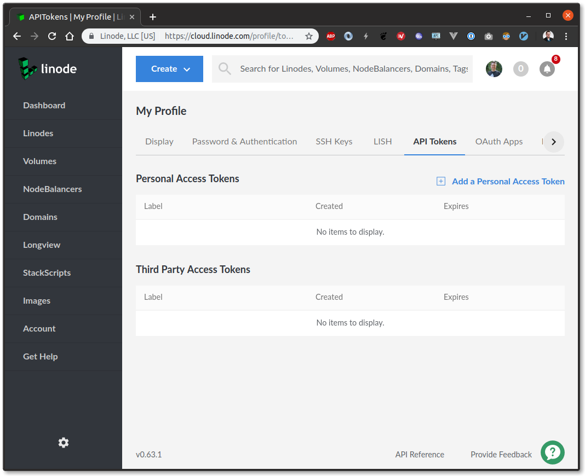
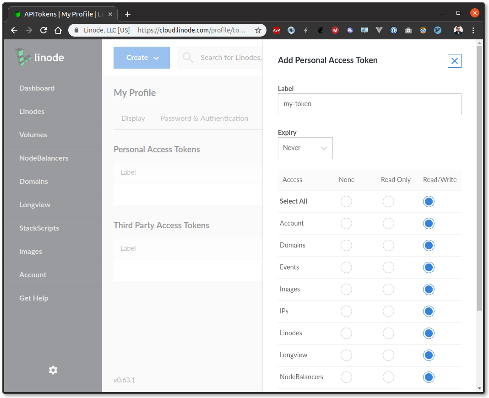
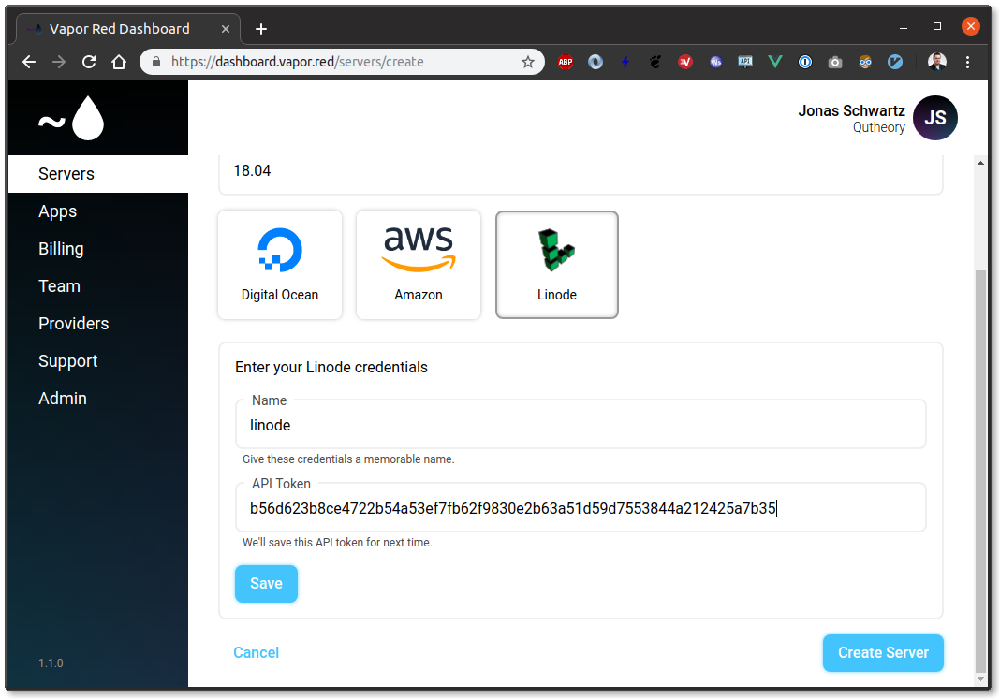
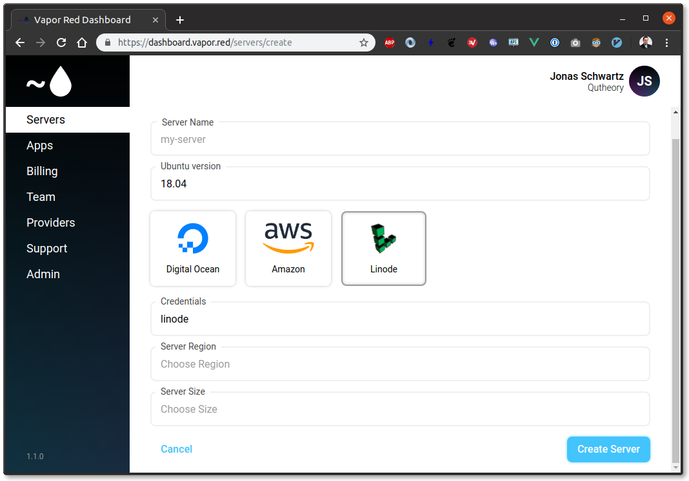

# Linode

This guide will show you how to configure Linode as a Vapor Red server provider. 

If you have not added any Linode credentials to your account, you will be prompted to add them while creating your first server. The token can be created from the Linode dashboard. Click your name in the top right corner, click My Profile and API Tokens.

Once you have accessed the token control panel, click Add a personal Access Token

You can name this token whatever you like, here we are naming it `my-token`. Make sure to set Expire to Never and Select All with Read/Write

After the token has been created, copy it. You will only be able to access the token's value once.

Now that you have a Linode API token, you can enter it into Vapor Red.

Once you click save, the token will be validated. If successful, you will now be able to select your newly added credentials from the Credentials drop down. 

You can now continue creating your server. Continue at [Quick Start &rarr; Create Server](../quick-start.md#create-server)
